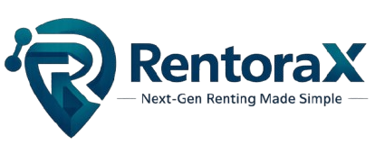

<p align="center">
  
</p>

# RentoraX - Professional Event Rental Platform 


RentoraX is a full-stack e-commerce rental platform designed to manage event equipment and products. It features a modern React frontend and a robust Spring Boot backend, providing a seamless experience for both customers and administrators.

---

## 🚀 Key Features

### 👤 For Customers
*   **User Authentication**: Secure sign-up and login with encrypted passwords.
*   **Browse & Search**: Dynamic product catalog with keyword search functionality.
*   **Booking System**: Request rentals, track status (Pending, Active, Past), and view rental history.
*   **Profile Management**: Update contact details, profile images, and change passwords securely.
*   **Notifications**: Real-time alerts for booking approvals and return reminders.

### 🔑 For Administrators
*   **Management Dashboard**: Comprehensive overview of total revenue, active rentals, and inventory levels.
*   **Inventory Control**: Full CRUD (Create, Read, Update, Delete) operations for rental items.
*   **Order Lifecycle**: Approve or reject rental requests and manage restocking.
*   **Analytics**: Visual earnings charts (7-day or 30-day views) for financial tracking.

---

## 🛠️ Technology Stack

### Backend
*   **Language**: Java 21
*   **Framework**: Spring Boot 4.0.6
*   **Security**: Spring Security with BCrypt password hashing
*   **Database**: MongoDB (NoSQL)
*   **Build Tool**: Maven

### Frontend
*   **Library**: React.js
*   **Build Tool**: Vite
*   **Styling**: Tailwind CSS
*   **State Management**: React Hooks & Context API

---

## ⚙️ Installation & Setup

### Prerequisites
*   Java 21 JDK
*   Node.js (v18+)
*   MongoDB (Local or Atlas)
*   Maven

### 1. Backend Setup
```bash
cd Backend
# Update application.properties with your MongoDB URI
mvn clean install
mvn spring-boot:run
```
The backend will start on `http://localhost:8080`.

### 2. Frontend Setup
```bash
cd rentorax-frontend/rentorax-frontend
npm install
npm run dev
```
The frontend will start on `http://localhost:5173` (or similar).

---

## 📑 API Documentation (Brief)

| Method | Endpoint | Description |
| :--- | :--- | :--- |
| `POST` | `/api/auth/register` | Register a new user |
| `POST` | `/api/auth/login` | Login and get user session |
| `GET` | `/api/items` | Fetch all rental items |
| `POST` | `/api/bookings` | Create a new rental request |
| `PUT` | `/api/bookings/{id}/approve` | Approve a pending order (Admin) |
| `GET` | `/api/dashboard/overview` | Get admin statistics |

---

## 🛡️ Professional Ethics & Standards
*   **Data Security**: We prioritize user privacy by never storing plain-text passwords and using industry-standard encryption.
*   **Architectural Integrity**: Following the Controller-Service-Repository pattern to ensure clean, maintainable, and testable code.
*   **Consistent API**: Using a unified `ApiResponse` format for reliable frontend-backend communication.
*   **CORS Protection**: Access control configured to allow only trusted origins.

---

## 👥 Contributors
**Group 3 Team** - *Developing the future of event rentals.*

---

## 📄 License
This project is for educational purposes as part of Group 3's coursework.
